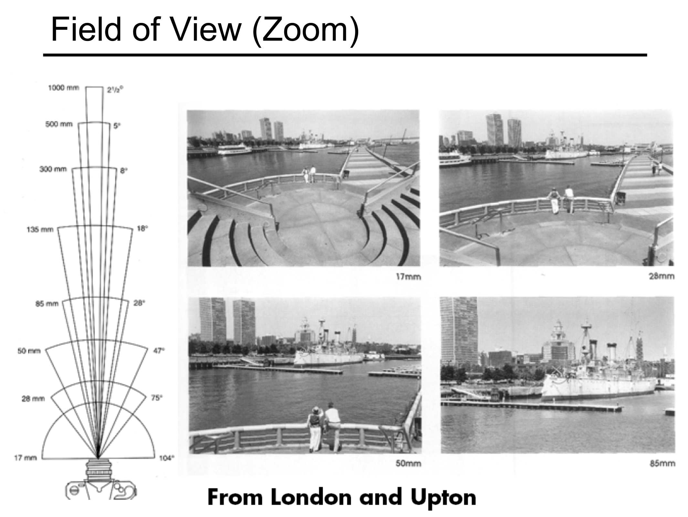

## gaussian_renderer directory and GaussianRasterizer class
- ./gaussian_renderer/
- render() method
```python
# gaussian_renderer/__init__.py
...
from diff_gaussian_rasterization import GaussianRasterizationSettings, GaussianRasterizer
...
def render(viewpoint_camera, pc : GaussianModel, pipe, bg_color : torch.Tensor, scaling_modifier = 1.0, override_color = None):
    ...
    tanfovx = math.tan(viewpoint_camera.FoVx * 0.5)
    tanfovy = math.tan(viewpoint_camera.FoVy * 0.5)

    raster_settings = GaussianRasterizationSettings(
        image_height=int(viewpoint_camera.image_height),
        image_width=int(viewpoint_camera.image_width),
        tanfovx=tanfovx,
        tanfovy=tanfovy,
        bg=bg_color,
        scale_modifier=scaling_modifier,
        viewmatrix=viewpoint_camera.world_view_transform,
        projmatrix=viewpoint_camera.full_proj_transform,
        sh_degree=pc.active_sh_degree,
        campos=viewpoint_camera.camera_center,
        prefiltered=False,
        debug=pipe.debug
    )

    rasterizer = GaussianRasterizer(raster_settings=raster_settings)

    ...
    rendered_image, radii = rasterizer(
        means3D = means3D,
        means2D = means2D,
        shs = shs,
        colors_precomp = colors_precomp,
        opacities = opacity,
        scales = scales,
        rotations = rotations,
        cov3D_precomp = cov3D_precomp)

    return {"render": rendered_image,
            "viewspace_points": screenspace_points,
            "visibility_filter" : radii > 0,
            "radii": radii}
```
### Rendering (渲染) and Rasterization (光栅化)
- Rendering: Rendering is the broader process of generating an image from a model. This model can include geometry (shapes and structures), texture (surface detail), lighting (how light interacts with surfaces), and shading (how colors and shadows are applied).
- Rasterization: **Rasterization is a specific method used within the rendering process** to convert 3D models into 2D images. It translates geometric data (like vertices and edges) into pixels or fragments.
### Paramters for Rendering 
- viewpoint_camera: the rendered image will be based on the viewpoint_camera
- pc (point cloud): 3D gaussian points that will be **splatted** on to the viewpoint camera plane
- pipe: pipe is create as the training starts. The pipe contains attributes to determine whether certain operation should be performed at certain place, e.g.,:
    ```python
    # whether need to precompute 3D convariance
    if pipe.compute_cov3D_python:
        cov3D_precomp = pc.get_covariance(scaling_modifier)
    # whether need to convert SH to rgb before rasterization
    if pipe.convert_SHs_python:
            shs_view = pc.get_features.transpose(1, 2).view(-1, 3, (pc.max_sh_degree+1)**2)
            dir_pp = (pc.get_xyz - viewpoint_camera.camera_center.repeat(pc.get_features.shape[0], 1))
            dir_pp_normalized = dir_pp/dir_pp.norm(dim=1, keepdim=True)
            sh2rgb = eval_sh(pc.active_sh_degree, shs_view, dir_pp_normalized)
            colors_precomp = torch.clamp_min(sh2rgb + 0.5, 0.0)
    ```
- bg_color: background color. Will occupy pixels that not have been rendered
- scaling_modifier: in the case that the resolution of the image is too large, may use scaling_modifier > 1 to downsample, similar to resolution_scales
- override_color: maybe a feature that can change the original color that whatever color we want
### Paramters for GaussianRasterizationSettings
- image_height: height of the rendered image
- image_width: width of the rendered image
- tanfovx: tangent of field of view in x-axis
    - fov： field of view(视场角\视野), quantified by angle 
    - 
- tanfovy: tangent of field of view in y-axis
- bg: background color
- scale_modifier: in the case that the resolution of the image is too large, may use scaling_modifier > 1 to downsample, similar to resolution_scales
- viewmatrix: viewpoint_camera.world_view_transform, the matrix defines the relation between the world space (3D space) and the camera space (view space)
- projmatrix: viewpoint_camera.full_proj_transform, combining vorld_view_matrix and projection matrix
    - relevant code:
    ```python
    # scene/cameras.py
    self.world_view_transform = torch.tensor(getWorld2View2(R, T, trans, scale)).transpose(0, 1).cuda()
    self.projection_matrix = getProjectionMatrix(znear=self.znear, zfar=self.zfar, fovX=self.FoVx, fovY=self.FoVy).transpose(0,1).cuda()
    self.full_proj_transform = (self.world_view_transform.unsqueeze(0).bmm(self.projection_matrix.unsqueeze(0))).squeeze(0)
    self.camera_center = self.world_view_transform.inverse()[3, :3]


    # utils/graphics_utils.py
    def getWorld2View2(R, t, translate=np.array([.0, .0, .0]), scale=1.0):
        Rt = np.zeros((4, 4))
        Rt[:3, :3] = R.transpose()
        Rt[:3, 3] = t
        Rt[3, 3] = 1.0

        C2W = np.linalg.inv(Rt)
        cam_center = C2W[:3, 3]
        cam_center = (cam_center + translate) * scale
        C2W[:3, 3] = cam_center
        Rt = np.linalg.inv(C2W)
        return np.float32(Rt)

    def getProjectionMatrix(znear, zfar, fovX, fovY):
        tanHalfFovY = math.tan((fovY / 2))
        tanHalfFovX = math.tan((fovX / 2))

        top = tanHalfFovY * znear
        bottom = -top
        right = tanHalfFovX * znear
        left = -right

        P = torch.zeros(4, 4)

        z_sign = 1.0

        P[0, 0] = 2.0 * znear / (right - left)
        P[1, 1] = 2.0 * znear / (top - bottom)
        P[0, 2] = (right + left) / (right - left)
        P[1, 2] = (top + bottom) / (top - bottom)
        P[3, 2] = z_sign
        P[2, 2] = z_sign * zfar / (zfar - znear)
        P[2, 3] = -(zfar * znear) / (zfar - znear)
        return P
    ```
- campos: the position of the camera (center of the viewpoint)
- prefiltered: refer to the low-pass filter in EWA splatting
    - relevant code: (this is a cuda function determine if a point in the screen. It seems that `prefiltered` indicates that the points have undergone some preprocessing, filtering points with `prefiltered=True` will trigger some warnings)
    - EWA splatting: We can either sample the continuous signal at a higher frequency or we eliminate frequencies above the Nyquist limit before sampling, which is called prefiltering.
    ```c
    __forceinline__ __device__ bool in_frustum(int idx,
    const float* orig_points,
    const float* viewmatrix,
    const float* projmatrix,
    bool prefiltered,
    float3& p_view)
    {
        float3 p_orig = { orig_points[3 * idx], orig_points[3 * idx + 1], orig_points[3 * idx + 2] };

        // Bring points to screen space
        float4 p_hom = transformPoint4x4(p_orig, projmatrix);
        float p_w = 1.0f / (p_hom.w + 0.0000001f);
        float3 p_proj = { p_hom.x * p_w, p_hom.y * p_w, p_hom.z * p_w };
        p_view = transformPoint4x3(p_orig, viewmatrix);

        if (p_view.z <= 0.2f)// || ((p_proj.x < -1.3 || p_proj.x > 1.3 || p_proj.y < -1.3 || p_proj.y > 1.3)))
        {
            if (prefiltered)
            {
                printf("Point is filtered although prefiltered is set. This shouldn't happen!");
                __trap();
            }
            return false;
        }
        return true;
    }
    ```
- debug: whether enable debug setting
#### Many of the parameters are related to cameras
- an example camera setting: 
```json
[{"id": 0, "img_name": "DSC05572", "width": 1264, "height": 832, "position": [3.1404339644832397, 0.18188197960281, -3.563482533678278], "rotation": [[0.9979604943324005, 0.011462677284412257, -0.06279696474594969], [-0.04072327873048568, 0.8718824481262268, -0.4880190684992303], [0.049157566266748824, 0.4895810491419074, 0.8705710367338437]], "fy": 1040.192756666184, "fx": 1040.007303759328}]
```
- cameras will be loaded by `utils/camera_utils.py` and then initialized by `scene/cameras.py`

## `submodules\diff-gaussian-rasterization`
- Differential Gaussian Rasterization
- A package contains functions that perform rasterization (rendering)
- Most of the parameters above will be used in this package to perform rasterization

### Relation to EWA splatting
- EWA: the whole object model is a resampling of a continuous function
- 3DGS: the point cloud is a resampling of a continuous function
- Volume Resampling in EWA & Rasterization in 3DGS
    - two ways of volume rendering: 
        - backward mapping (NeRF)
        - forward mapping (EWA & 3DGS)
    - EWA: Mapping the data onto the image plane involves a sequence of intermediate steps where the data is transformed to different coordinate systems
    - final goal: 3D points -> 2D images that can be perceived by human

### Data Flow
- source space / object space / world space -> camera space -> ray space -> screen space (viewport coordinates)

### Detailed Implementation
- `submodules\diff-gaussian-rasterization\diff_gaussian_rasterization\__init__.py` invokes C++/CUDA rasterizer
    - examples of invoking a C++/CUDA function: 
    ```python
    from . import _C
    ...
    # Invoke C++/CUDA rasterizer
    if raster_settings.debug:
            cpu_args = cpu_deep_copy_tuple(args) # Copy them before they can be corrupted
            try:
                num_rendered, color, radii, geomBuffer, binningBuffer, imgBuffer = _C.rasterize_gaussians(*args)
            except Exception as ex:
                torch.save(cpu_args, "snapshot_fw.dump")
                print("\nAn error occured in forward. Please forward snapshot_fw.dump for debugging.")
                raise ex
        else:
            num_rendered, color, radii, geomBuffer, binningBuffer, imgBuffer = _C.rasterize_gaussians(*args)
    ...
    # Compute gradients for relevant tensors by invoking backward method
    if raster_settings.debug:
        cpu_args = cpu_deep_copy_tuple(args) # Copy them before they can be corrupted
        try:
            grad_means2D, grad_colors_precomp, grad_opacities, grad_means3D, grad_cov3Ds_precomp, grad_sh, grad_scales, grad_rotations = _C.rasterize_gaussians_backward(*args)
        except Exception as ex:
            torch.save(cpu_args, "snapshot_bw.dump")
            print("\nAn error occured in backward. Writing snapshot_bw.dump for debugging.\n")
            raise ex
    else:
            grad_means2D, grad_colors_precomp, grad_opacities, grad_means3D, grad_cov3Ds_precomp, grad_sh, grad_scales, grad_rotations = _C.rasterize_gaussians_backward(*args)
    ...
    def markVisible(self, positions):
        # Mark visible points (based on frustum culling for camera) with a boolean 
        with torch.no_grad():
            raster_settings = self.raster_settings
            visible = _C.mark_visible(
                positions,
                raster_settings.viewmatrix,
                raster_settings.projmatrix)
            
        return visible
    ```
#### C++/CUDA rasterizer details
- directory hierachy: 
```
diff-gaussian-rasterization/
├── cuda_rasterizer/       # C++/CUDA rasterizer implementation
│   ├── auxiliary.h        # Auxiliary functions and definitions
│   ├── backward.cu        # CUDA kernel for backward pass (gradient computation)
│   ├── backward.h         # Header file for backward pass
│   ├── forward.cu         # CUDA kernel for forward pass (rasterization)
│   ├── forward.h          # Header file for forward pass
│   ├── rasterizer_impl.cu # Main CUDA rasterizer implementation
│   ├── rasterizer_impl.h  # Header file for main rasterizer implementation
│   ├── rasterizer.h       # Header file for rasterizer interface
├── diff_gaussian_rasterization/  # Python initialization module
│   ├── __init__.py        # Python package initialization
├── third_party/           # Third-party packages
│   └── glm/               # OpenGL Mathematics library
├── CMakeLists.txt         # CMake configuration file for building the project
├── ext.cpp                # C++ extension module definition for Python
├── rasterize_points.cu    # CUDA kernel for rasterizing points
├── rasterize_points.h     # Header file for point rasterization
├── setup.py               # Python setup script for building and installing the package
```
- forward process (forward.cu & forward.h): 
    - forward mapping mentioned in EWA splatting 
    - the process of rendering and rasterization
    - obtain rendered image that can compute loss
- backward process (backward.cu & backward.h): 
    - computing gradient for minimizing loss
    - optimize the parameters

# EWA Splatting
## Abstract 
- high quality splatting using elliptical Gaussian kernel
- avoid aliasing artifacts (can refer to [[常见的伪影](https://wangwei1237.gitbook.io/digital_video_concepts/shi-pin-zhi-liang-du-liang/4_1_0_compressionlossartifactsandvisualquality/4_1_2_commonartifacts#shan-shuo-xiao-ying-flickering-artifacts)])
    - image aliasing: 
        - Moire Pattern (摩尔纹)
        - Jagged Edge (锯齿状边缘)
        - Pixelation (像素化)
    - video aliasing: 
        - Temporal Aliasing: frame rate is too low
        - Flickering (闪烁效应)
- introduce the concept of a resampling fliter, combining a reconstruction kernel with a low-pass filter
- like EWA (elliptical weighted average) filter for texture mapping -> EWA splatting
- EWA splat primitives 
- can be used in regular, rectilinear, and irregular dataset
- EWA volume reconstruction kernels can be reduced to surface reconstruction kernels

## Introduction
### Ideal Volume Rendering
- The ideal volume rendering algorithm **reconstructs a continuous function** in 3D, **transforms** this 3D function into screen space, and then **evaluates opacity integrals** along line-of-sights
    - Reconstructing a continuous function in 3D
        - The 3D data is often stored as a discrete set of samples (voxels). Reconstructing a continuous function means interpolating these discrete samples to create a smooth, continuous representation of the 3D volume
        - may use interpolation 
    - Transforms to screen space
        - project the function to 2D space so that human can see
    - Evaluates opacity integrals
        - Imagine casting rays from the viewer's eye through each pixel on the screen into the 3D volume. Each ray represents a line of sight

### Splatting Algorithm
- volume data -> set of particles absorbing and emitting light
- line integrals are precomputed across each particles separately -> **footprint functions / splats** -> final image
- elliptical weighted average texture filter
- concept of ray space:
    - a point in ray space: $x = (x_0, x_1, x_2)^T$
    - $x_0, x_1$ -> a point on the projection plane
    - synonyms: $\textbf{x}, (textbf{x}, x_2)^T, (x_0, x_1, x_2)^T$
    - light intensity: 
    - extinction function in ray space (after perform transformation from source space / object space): 
        - where $\varphi$ is the mapping from object space to camera space, $\phi$ is the mapping from camera space to ray space
    - substituting (8) into (7) we obtain a reconstruction kernel call it $g_c$: 
    - Assumption: 
        - Usually, the reconstruction kernels $r_{k}'(x)$ have local support. The splatting approach assumes that these local support areas do not overlap along a ray x and the reconstruction kernels are ordered front to back
        - emission coefficient is constant in the support of each reconstruction kernel along a ray
        - approximate the exponential function with the first two terms of its Taylor expansion, thus $e^{-x} \approx 1 - x$
        - ignore self-occlusion
    - yielding: 
    - $q_k(x)$: footprint function of each point on the screen is an ellipse whose shape and orientation depend on the point's properties and the viewing parameters