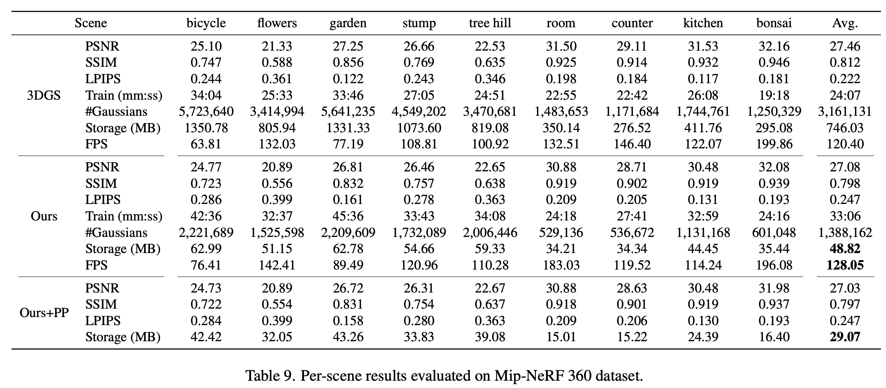
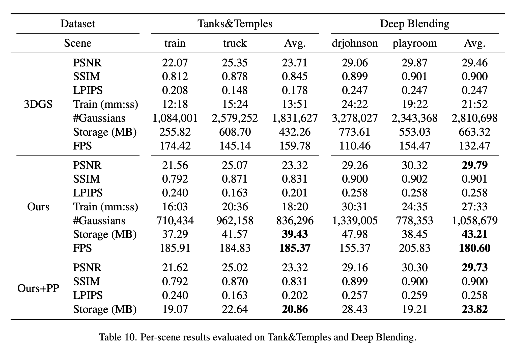

# TODO
1. Check evaluation metrics of c3dgs
2. Incorporate view-dependent color to our code
    - `gaussian_renderer`
        - `__init__.py`
            - compute dir_pp and shs
            - contract_to_unisphere
    - `scene`
        - `gaussian_model.py`
            - create recolor, direction_encoding, and mlp_head
            - delete get_feature
            - add precompute and contract_to_unisphere
    - `train.py`
        - initialization of gaussian model `gaussians = GaussianModel(dataset)`
## Evaluation Metrics of c3dgs
- Mip-nerf 360

- T&T and Deep Blending

- Compression rate: 
    - c3dgs: around 90% (1/10)
    - c3dgs + post-processing: around 96% (1/25)
        - post-processing:
            1. Applying 8-bit min-max quantization to opacity and hash grid parameters.
            2. Pruning hash grid parameters with values below 0.1.
            3. Applying Huffman encoding on the quantized opacity and hash parameters, and R-VQ indices.