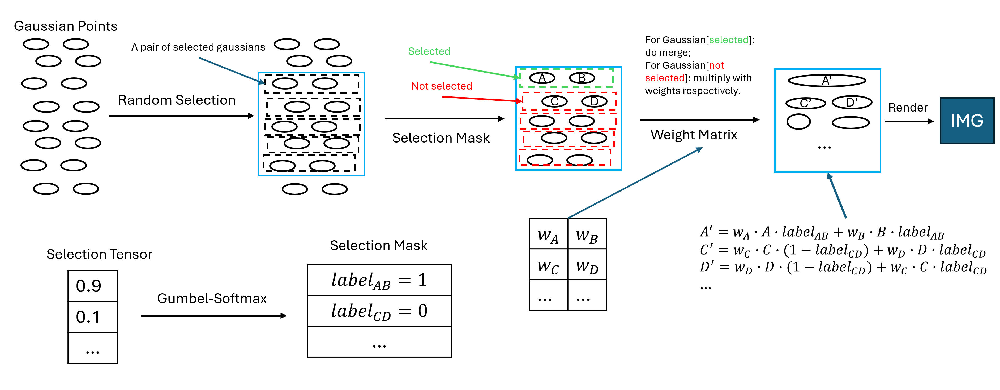

# New Implementation of Weight Merge
- diagram of new weight hierachy
- 
## Remarks
- To confine the sum of Truths in mask to be a certain value, we may corporate a loss for the selection mask: 
    - sum of Truths -> certain value ↔ loss for selection mask -> 0
- For the convenience of backpropagation, we may multiply the label from selection mask during merging
