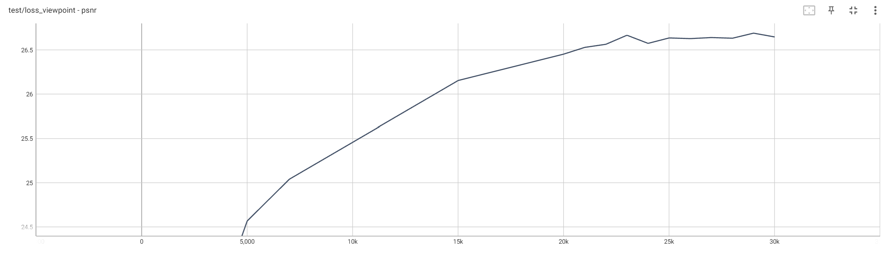
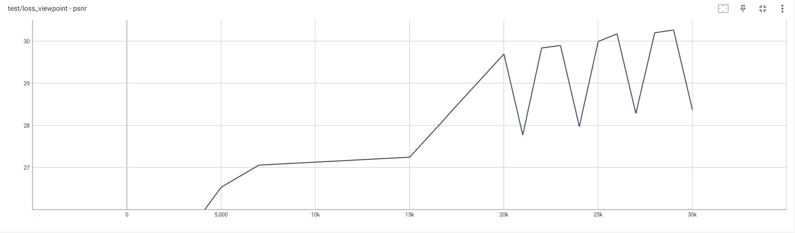

# Experiments Results
| dataset | arguments | testing psnr | Gaussian points number | 
|----------|----------|----------|----------|
| train | 500 + 1000 + 1500 (3000) | 21.54 | 4.4e+5 |
|truck |500 + 1000 + 1500 (3000) | 24.53 | 1.04e+6 |
|bicycle |500 + 1000 + 1500 (3000) |24.26 |1.31e+6 |
|bonsai |500 + 1000 + 1500 (3000) |31.86 | 7.57e+5 |
|counter |500 + 1000 + 1500 (3000) |28.45 |5.25e+5 |
|drjohnson |500 + 1000 + 1500 (2000) |27.95 (*best*) |7.46e+5 |
|garden |500 + 1000 + 1500 (3000) |26.74 |2.1e+6 |
|kitchen |500 + 1000 + 1500 (3000) |29.46 | 6.94e+5|
|playroom |500 + 1000 + 1500 (2000) |30.02 | 5.97e+5|
|room |500 + 1500 + 1000 (2000) |31.07(*best*) |5.76e+5 |
|stump |500 + 1000 + 1500 (3000) | 25.21 |5.88e+5 |

# PSNR Comparison
|dataset | 3dgs | lightGaussian | c3dgs | ours | 
|----------|----------|----------|----------|----------|
| train | 22.03 | 21.41 | 21.56 | 21.54 |
| truck | 25.39 | 24.85 | 25.07 | 24.53 |
| bicycle | 25.25 | 25.09 | 24.77 |24.26 |
| bonsai | 31.98 | 31.46 | 32.08 |31.86 |
| counter | 28.70 | 28.46 | 28.71 |28.45 |
| drjohnson | 28.77 | N.A. | 29.26 |27.95 (*best*) |
| garden | 27.41 | 27.04 | 26.81 |26.74 |
| kitchen | 30.317 | 30.97 | 30.48 |29.46 |
| playroom | 30.04 | N.A. | 30.32 |30.02 |
| room | 30.63 | 31.68 | 30.88 |31.07(*best*) |
| stump | 26.55 | 26.86 | 26.46 |25.21 |


# Remarks
- *best* means the best psnr in the training process, and the model's performance has decreased after 30000 iterations
- if not specify, the model attain its best performance at iteration 30000
- command for checking tensorboard result:
```sh
tensorboard --logdir=/mnt/hdd4T/www_home/project/learn/gaussian-splatting/output/merge_debug/bicycle/1022_with_fps_ITER_30000_DI_500_OI_1000_MI_1500_MPN_2000
tensorboard --logdir=/mnt/hdd4T/www_home/project/learn/gaussian-splatting/output/merge_debug/bonsai/1022_with_fps_ITER_30000_DI_500_OI_1000_MI_1500_MPN_2000
tensorboard --logdir=/mnt/hdd4T/www_home/project/learn/gaussian-splatting/output/merge_debug/counter/1022_with_fps_ITER_30000_DI_500_OI_1000_MI_1500_MPN_2000
tensorboard --logdir=/mnt/hdd4T/www_home/project/learn/gaussian-splatting/output/merge_debug/drjohnson/1022_with_fps_ITER_30000_DI_500_OI_1000_MI_1500_MPN_2000
tensorboard --logdir=/mnt/hdd4T/www_home/project/learn/gaussian-splatting/output/merge_debug/garden/1022_with_fps_ITER_30000_DI_500_OI_1000_MI_1500_MPN_2000
tensorboard --logdir=/mnt/hdd4T/www_home/project/learn/gaussian-splatting/output/merge_debug/kitchen/1022_with_fps_ITER_30000_DI_500_OI_1000_MI_1500_MPN_2000
tensorboard --logdir=/mnt/hdd4T/www_home/project/learn/gaussian-splatting/output/merge_debug/playroom/1022_with_fps_ITER_30000_DI_500_OI_1000_MI_1500_MPN_2000
tensorboard --logdir=/mnt/hdd4T/www_home/project/learn/gaussian-splatting/output/merge_debug/room/1022_with_fps_ITER_30000_DI_500_OI_1000_MI_1500_MPN_2000
tensorboard --logdir=/mnt/hdd4T/www_home/project/learn/gaussian-splatting/output/merge_debug/stump/1022_with_fps_ITER_30000_DI_500_OI_1000_MI_1500_MPN_2000
tensorboard --logdir=/mnt/hdd4T/www_home/project/learn/gaussian-splatting/output/merge_debug/train/1022_with_fps_ITER_30000_DI_500_OI_1000_MI_1500_MPN_2000
tensorboard --logdir=/mnt/hdd4T/www_home/project/learn/gaussian-splatting/output/merge_debug/truck/1022_with_fps_ITER_30000_DI_500_OI_1000_MI_1500_MPN_2000
```

# Experiments Results (Afternoon)
| dataset | arguments | testing psnr | Gaussian points number | 
|----------|----------|----------|----------|
| train | 500 + 1500 + 1000 (2000) | 21.72 | 4.46e+5 |
|truck |500 + 1500 + 1000 (2000) | 24.56 | 1.05e+6 |
|bicycle |500 + 1500 + 1000 (2000) |24.27 |1.31e+6 |
|bonsai |500 + 1500 + 1000 (2000) |31.97 | 7.68e+5 |
|counter |500 + 1500 + 1000 (2000) |28.60 |5.41e+5 |
|drjohnson |500 + 1000 + 1500 (2000) |27.95 (*best iter*: 29000) |7.46e+5 |
|garden |500 + 1500 + 1000 (2000) |26.69 (*best iter*: 29000) |2.1e+6 |
|kitchen |500 + 1500 + 1000 (2000) |30.27 (*best iter*: 29000) | 6.89e+5|
|playroom |500 + 1500 + 1000 (2000) |30.10 (*best iter*: 28000) | 6.06e+5|
|room |500 + 1500 + 1000 (2000) |31.07(*best iter*: 29000) |5.76e+5 |
|stump |500 + 1500 + 1000 (2000) | 25.33 (*best iter:* 29000) |6.04e+5 |

## Gaussian Points Comparison
|dataset | 3dgs | lightGaussian | c3dgs | ours | 
|----------|----------|----------|----------|----------|
| train | 1,084,001 | N.A. | 710,434 | 4.46e+5 |
| truck | 2,579,252 | N.A. | 962,158 | 1.05e+6 |
| bicycle | 5,723,640 | N.A. | 2,221,689 |1.31e+6 |
| bonsai | 1,250,329 | N.A. | 601,048 |7.6e+5 |
| counter | 1,171,684 | N.A. | 536,672 |5.21e+5 |
| drjohnson | 3,278,027 | N.A. | 1,339,005 |7.46e+5 |
| garden | 5,641,235 | N.A. | 2,209,609 |2.1e+6 |
| kitchen | 1,744,761 | N.A. | 1,131,168 |6.89e+5|
| playroom | 2,343,368 | N.A. | 778,353 |6.06e+5|
| room | 1,483,653 | N.A. | 529,136 |5.76e+5 |
| stump | 4,549,202 | N.A. | 1,732,089 |6.04e+5 |

# Experiments Results 1022
| dataset | arguments | testing psnr | Gaussian points number | 
|----------|----------|----------|----------|
| train | 400 + 1500 + 1100 (2500) | 21.52(*best iter*: 28000) | 4.03e+5 |
|truck |400 + 1500 + 1100 (2500) | 24.48 | 8.53e+5 |
|bicycle |400 + 1500 + 1100 (2500) | 24.16(*best iter*: 29000) | 1.01e+6 |
|bonsai |400 + 1500 + 1100 (2500) | 32.03 | 6.63e+5 |
|counter |400 + 1500 + 1100 (2500) | 28.73 |4.64e+5 |
|drjohnson |400 + 1500 + 1100 (2500)| 28.9 | 6.1e+5 |
|garden |400 + 1500 + 1100 (2500) | 26.71(*best iter*: 28000) | 1.77e+6 |
|kitchen |400 + 1500 + 1100 (2500) | 30.46 | 6.12e+5 |
|playroom |400 + 1500 + 1100 (2500) | 30.22(*best iter*: 28000) | 5.11e+5 |
|room |400 + 1500 + 1100 (2500) | 31.18 | 4.76e+5 |
|stump |400 + 1500 + 1100 (2500) |  25.17(*best iter:* 29000) | 4.47e+5 |

## Observation
- *remarks: tested at following iterations: [1000, 5000, 7000, 15000, 20000, 21000, 22000, 23000, 24000, 25000, 26000, 27000, 28000, 29000, 30000]*
- Best score always occurs at iteration 29000: Scene: garden
    - 
- Sometimes occurs oscillation at late iterations: Scene: kitchen
    - 
- In terms of gaussian points number, our results on all dataset are less than 3dgs. However, our model outperforms the c3dgs on train, kitchen and so on, while it shows comparable or slightly lower performance on truck, bonsai, counter and so on.
    - this might due to inproper training arguments setting
## Inspiration
- Maybe we can increase the number of merge points, and stop merging and let the model optimize after some iteration other than 15k
- Design better mechanism for different dataset when determine training arguments


