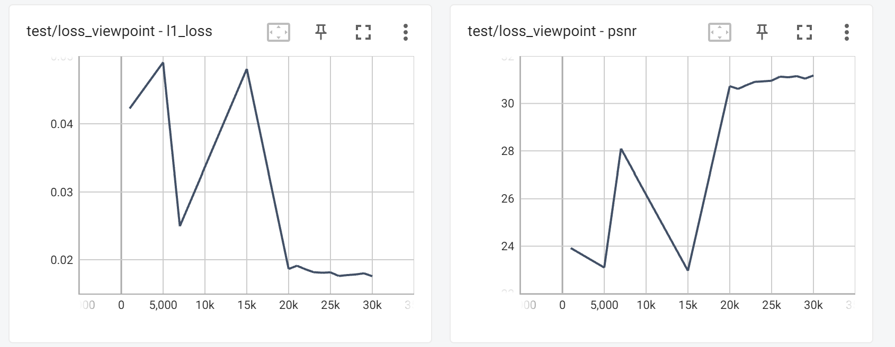
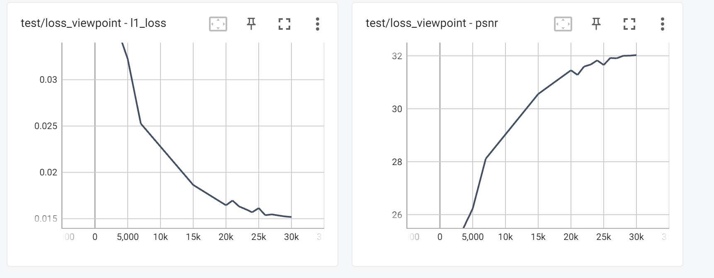

# Comparison
## Ours' Best Result
| dataset | arguments | testing psnr | Gaussian points number | 
|----------|----------|----------|----------|
| train | 500 + 1500 + 1000 (2000) | 21.72 | 4.46e+5 |
|truck |500 + 1500 + 1000 (2000) | 24.56 | 8.53e+5 |
|bicycle |500 + 1500 + 1000 (2000) | 24.27 | 1.01e+6 |
|bonsai |400 + 1500 + 1100 (2500) | 32.03 | 6.63e+5 |
|counter |400 + 1500 + 1100 (2500) | 28.73 |4.64e+5 |
|drjohnson |400 + 1500 + 1100 (2500)| 28.9 | 6.1e+5 |
|garden |500 + 1000 + 1500 (3000) | 26.74 | 2.1e+6 |
|kitchen |400 + 1500 + 1100 (2500) | 30.46 | 6.12e+5 |
|playroom |400 + 1500 + 1100 (2500) | 30.22 | 5.11e+5 |
|room |400 + 1500 + 1100 (2500) | 31.18 | 4.76e+5 |
|stump |500 + 1500 + 1000 (2000) |  25.33 | 6.04e+5 |

## Remarks
- *italic* means our model demonstrates inferior performance on certain dataset
- **bold** means our model demonstrates superior performance on certain dataset
- no special font style means our model demostrates similar performance on certain dataset
- best score for the dataset is highlight with red background
## PNSR
| dataset | 3dgs | lightGaussian | c3dgs | ours |
|----------|----------|----------|----------|----------|
| bicycle | 25.25 | 25.09 | 24.77 | *24.27* |
| bonsai | 31.98 | 31.46 | 32.08 | **32.03** |
| counter | 28.70 | 28.46 | 28.71 | **28.73** |
| drjohnson | 28.77 | N.A. | 29.26 | **28.9** |
| garden | 27.41 | 27.04 | 26.81 | 26.74 |
| kitchen | 30.317 | 30.97 | 30.48 | **30.46** |
| playroom | 30.04 | N.A. | 30.32 | **30.22** |
| room | 30.63 | 31.68 | 30.88 | **31.18** |
| stump | 26.55 | 26.86 | 26.46 | *25.33* |
| train | 22.03 | 21.41 | 21.56 | 21.72 |
| truck | 25.39 | 24.85 | 25.07 | *24.56* |

## Gaussian Points Number
| dataset | 3dgs | lightGaussian | c3dgs | ours |
|----------|----------|----------|----------|----------|
| train | 1,084,001 | N.A. | 710,434 | **4.46e+5** |
| truck | 2,579,252 | N.A. | 962,158 | 8.53e+5 |
| bicycle | 5,723,640 | N.A. | 2,221,689 | **1.01e+6** |
| bonsai | 1,250,329 | N.A. | 601,048 | *6.63e+5* |
| counter | 1,171,684 | N.A. | 536,672 | 4.64e+5 |
| drjohnson | 3,278,027 | N.A. | 1,339,005 | **6.1e+5** |
| garden | 5,641,235 | N.A. | 2,209,609 | 2.1e+6 |
| kitchen | 1,744,761 | N.A. | 1,131,168 | **6.12e+5** |
| playroom | 2,343,368 | N.A. | 778,353 | **5.11e+5** |
| room | 1,483,653 | N.A. | 529,136 | 4.76e+5 |
| stump | 4,549,202 | N.A. | 1,732,089 | **6.04e+5** |

## Observation
- room's PNSR curve
    - 
    - possible reason:
        - merging operation causes decline
- bonsai and other's curves
    - 
    - smooth increase in PSNR and decrease in loss
v
